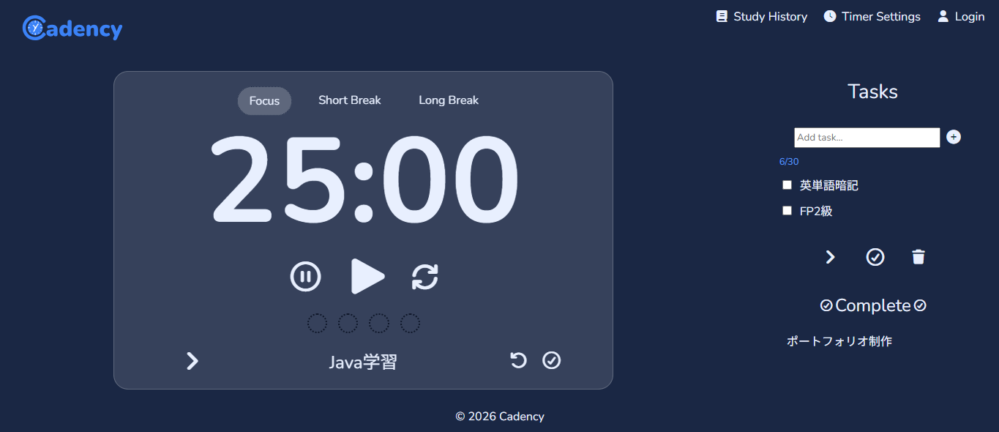
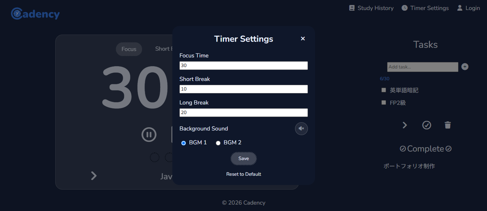
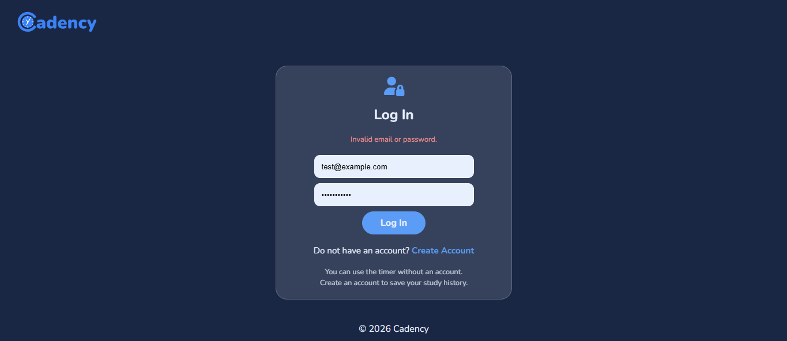
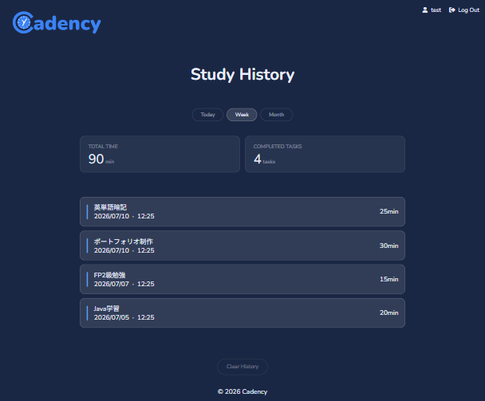
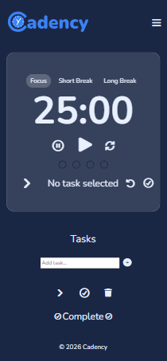

# Cadency : ポモドーロタイマーアプリ
ポモドーロ・テクニックに基づいた生産性向上アプリです。
タスク管理や学習履歴の記録機能を備えています。

*URL* https://cadency-pomodoro-timer-production.up.railway.app
*Testuser* ID: test@example.com / Password: password123

## スクリーンショット

### タイマー画面


### タイマー設定


### ログイン画面(バリデーションエラー表示)


### 学習履歴


### レスポンシブ表示(モバイル)


## 開発の動機
プログラミングはもちろんのこと語学やファイナンシャルプランニング等、勉強したいことが多く、しっかり時間とタスクの管理をしたいと思ったため

## 主な機能
- ポモドーロタイマー：Focus / Short Break / Long Break の各モードと自動切り替え機能
- タスク管理：タスクの追加・完了・削除、および現在取組中タスクの設定
- タイマー設定：作業時間や休憩時間のカスタマイズ
- 学習履歴：ユーザーごとのセッションログ記録（「Today」「Week」「Month」での絞り込み表示）
- BGM再生：Focus中の集中用サウンド(ON/OFF・種類切り替え対応)
- アカウント機能：新規登録・ログイン・ログアウト(ゲストでもタイマー単体は利用可能)

## 工夫した点
- ユーザー登録時はメールアドレスの重複チェックを行った上で、パスワードをハッシュ化して保存し、セキュリティを強化
- 学習ログの保存では、通信自体が失敗した場合とサーバー側で保存に失敗した場合を分けて検知し、それぞれログに出力するようエラー処理を実装
- 画面サイズが端末ごとに異なる問題に対し、固定pxではなくclampを採用し、余白やフォントサイズが画面の幅・高さに応じて可変するレスポンシブ設計を実装
- フォーム送信後はページを再読み込みさせることで、ブラウザの「戻る」操作時に発生する「フォーム再送信」の警告を防止
- BGM再生はブラウザの自動再生ポリシーを考慮し、ユーザーの操作(タイマー開始)を起点にのみ再生する設計

## セットアップ手順(ローカル環境)
1. リポジトリをクローン
   ```
   git clone https://github.com/meit93/cadency-pomodoro-timer.git
   ```
2. XAMPP等でApache・MySQLを起動し、`htdocs`配下に配置
3. `schema.sql`をMySQLで実行し、`cadency`データベースとテーブルを作成
4. ブラウザで `http://localhost/cadency-pomodoro-timer/index.php` にアクセス

## 技術スタック
- Frontend : HTML / CSS / JavaScript
- Backend : PHP8
- Database : MySQL
- Infrastructure : Railway
職業訓練で習得したスキルを強化し実務レベルに引き上げたいと思い、以上の技術スタックを選定しました。

## 今後の展望
- Google Analyticsによるアクセス解析の導入
- GitHub Actionsを用いたCI/CDパイプラインの構築

## License
The MIT License (MIT) 2026